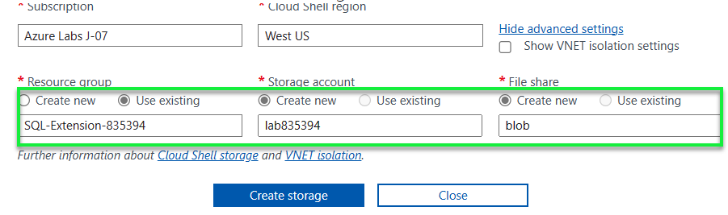

# SQL IaaS Extension workshop

## Goals

| **Goal**              | *Description*                                    |
| ----------------------------- | --------------------------------------------------------------------- |
| **What will you learn**       | *The benefits of enabling the SQL Server IaaS extension on your virtual machines* |
| **Duration**                  | *Two hours*                                                                |
| **Microsoft Cloud Topics taught**                  | *Azure, Azure SQL Server on VM*                                                                |
| **Slides** | [Powerpoint](BenefitsofSQLVMIaaSextension.pptx) 

## SQL Server IaaS Extension


## Here is a video summary of the benefits of SQL IaaS Extension and how to enable the feature on your VM's with SQL Server

Overview video regarding the benefits of the SQL Server IaaS Extension [available here](https://www.youtube.com/watch?v=KUlpjoeFipk).

## What workshop attendees will learn

The SQL Server IaaS Agent extension allows for integration with the Azure portal and unlocks a number of feature benefits for SQL Server on Azure VMs:

**Feature benefits:** The extension unlocks a number of automation feature benefits, such as portal management, license flexibility, automated backup, automated patching and more. See Feature benefits later in this article for details.

**Compliance:** The extension offers a simplified method to fulfill the requirement of notifying Microsoft that the Azure Hybrid Benefit has been enabled as is specified in the product terms. This process negates needing to manage licensing registration forms for each resource.

**Free:** The extension in all three manageability modes is completely free. There is no additional cost associated with the extension, or with changing management modes.

**Simplified license management:** The extension simplifies SQL Server license management, and allows you to quickly identify SQL Server VMs with the Azure Hybrid Benefit enabled using the Azure portal, PowerShell or the Azure CLI.

### Benefits overview


### Options for enabling the extension


PowerShell scripts can be found [here](./solution)

## Workshop Steps

### Part 1 - Preparation

1. Download the PowerPoint presentation from [here](BenefitsofSQLVMIaaSextension.pptx).
2. Review the presentation.
3. Browse the PowerShell scripts [here](./solution).

### Part 2 - Enable SQL IaaS Extention per subscription 

4. Open a new browser tab and then go to your Azure portal by copying this [link](https://portal.azure.com).
5. In the Azure portal search on "SQL Virtual Machines" in the top center search bar and click it under the Services section.


6. Click the button labeled "Automatic SQL Server VM Registration" at the top of the screen.


7. Now pick the subscription you want to enable the SQL IaaS extension for, accept the terms and then click the Register button. 


8. To enhance the data shown on the SQL Virtual Machines view, click "Manage View" and then pick the "Edit Columns" option.


9. Add the column "Management Mode" and click save. This new column will show you if your SQL IaaS extension is in lightweight or full mode.


10. Your view should now look similar to this:


### Part 3 - If you want to immediately install the SQL IaaS extension on a VM and not wait for the above automatic registration to happen, which can take 24 hours, use PowerShell to enable the extenstion on a VM.

11.  In order to turn on the SQL IaaS extension individually on a VM you can use PowerShell in the Azure Cloud Shell. To start the cloud shell click the button on top right as shown in this screen shot.


If prompted about not having a storage account mounted, click on Show advanced settings. Select Create new under Storage account and provide values as below:

Resource Group: Select **Use existing** then
Storage account: storage
File Share: blob



After several seconds you will see the cloud shell command line.


12. Now run the following PowerShell script to see a list of all VM's in your subscription

```powershell
Get-AzVM
```

13. Now run the following to set vairables for the final PowerShell script. "VM2" below should be replaced by your VM name. "VM1_Group" should be replaced
by the name of the resource group your VM is in.

```powershell
$vm = Get-AzVM -Name VM2 -ResourceGroupName VM1_Group
```
14. Now run the script to turn on SQL IaaS Extension in lightweigt mode.

```powershell
New-AzSqlVM -Name $vm.Name -ResourceGroupName $vm.ResourceGroupName -Location $vm.Location `
 -LicenseType AHUB  -SqlManagementType LightWeight
```

15. Review the output to make sure there are no errors.

16. If you need to remove the extension run the following script.

```powershell
Remove-AzSqlVM -Name $vm.Name -ResourceGroupName $vm.ResourceGroupName 
```

## Links

Microsoft documentation for SQL Server IaaS Extension [available here](https://learn.microsoft.com/en-us/azure/azure-sql/virtual-machines/windows/sql-server-iaas-agent-extension-automate-management?view=azuresql&tabs=azure-powershell)

Migrate on-prem SQL Server to Azure VM using Azure Data Studio [click here](https://learn.microsoft.com/en-us/azure/dms/tutorial-sql-server-to-virtual-machine-online-ads)

What is SQL Server IaaS Agent Video on Data Exposed [here](https://techcommunity.microsoft.com/t5/video-hub/azure-sql-vm-what-is-sql-server-iaas-agent-extension-ep-2-data/ba-p/2617227)

Baseline Powershell modules to create your own custom code and deeper dives can be found [here](https://learn.microsoft.com/en-us/azure/azure-sql/virtual-machines/windows/sql-agent-extension-manually-register-single-vm?view=azuresql&tabs=powershell)  or just use the prebuilt scripts for a much easier interface.

SQL Server Privacy Statement for the IaaS extension agent [here](https://learn.microsoft.com/en-us/sql/sql-server/sql-server-privacy?view=sql-server-ver16#non-personal-data)


[Code of Conduct](../CODE_OF_CONDUCT.md)

